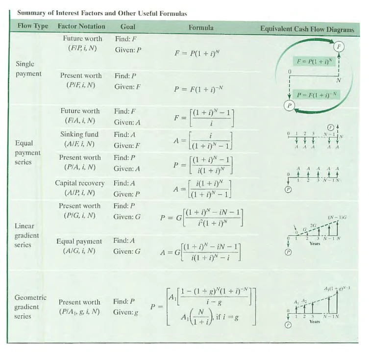

# Sama calculator
Engineering Economic Analysis - Calculator Interpreter.

Calculator for interest factors and different economic formulas. It takes the formulas expression as-is, parse it, and calculates the result. The system has [an interpreter](./interpreter/) for discrete compounding formulas with discrete payments, along [a web site and a mobile app client](./clients/), and an [Rest api](./api/).

## Live deployments
- Site: https://sama.up.railway.app/
- Mobile app: https://play.google.com/store/apps/details?id=org.autostream.sama
- Api: https://samaapi.up.railway.app/redoc/

## Supported formulas

 
Source: Park, Chan S., Fundamentals of Engineering Economics, 3rdEd., Prentice Hall (2013)

## TODO
* <s>Enhance the website frontend.</s>
* <s>Add history feature, for previously inserted calculations.</s>
* Support more formulas.

<small>Licensed under GPL.
